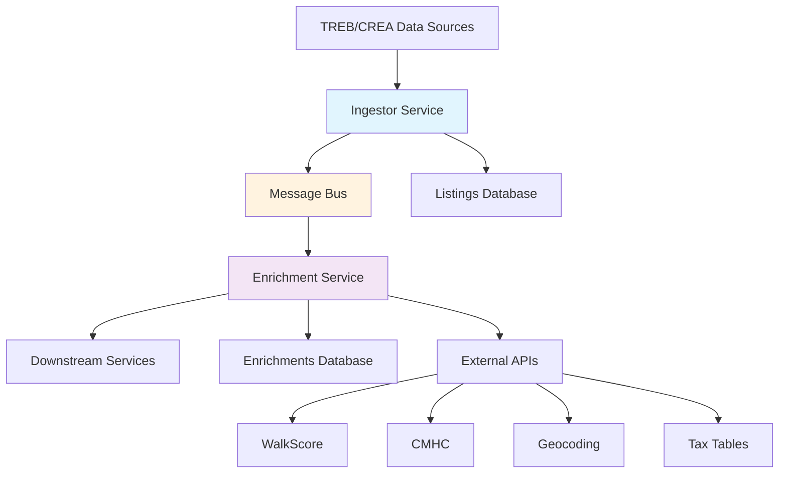

# Real Estate Microservices Platform

## �� Quick Demo

**Want to see the platform in action?** Start with our comprehensive demo GUI:

```bash
# Install all dependencies (including demo)
npm run install:all

# Start the demo GUI
npm run dev:demo
```

Then open [http://localhost:3000](http://localhost:3000) to explore:
- Real-time property listings feed
- Data enrichment pipeline visualization  
- Investment analysis dashboard
- Saved searches and live alerts
- System monitoring

---

# Real Estate Microservices

A comprehensive microservices ecosystem for real estate data processing and enrichment.

## 🏗️ Architecture Overview



## 📦 Services

### 🔄 [Ingestor Service](./ingestor/)

Ingests and normalizes real estate listing data from multiple sources (TREB, CREA).

**Key Features:**

- ✅ Polling-based data ingestion
- ✅ Data normalization and validation
- ✅ Change detection and event publishing
- ✅ Watermark-based incremental processing
- ✅ Comprehensive test coverage

### 🎯 [Enrichment Service](./enrichment/)

Enriches listings with market data, location scores, and financial calculations.

**Key Features:**

- ✅ Event-driven processing with debouncing
- ✅ Geocoding and location scoring
- ✅ Tax estimation and fee validation
- ✅ Rent prior calculations
- ✅ Caching for external API calls
- ✅ Underwrite event publishing

### 🧪 [Integration Tests](./integration-tests/)

Comprehensive end-to-end testing of service communication.

**Key Features:**

- ✅ Message bus communication testing
- ✅ Data synchronization validation
- ✅ Event processing verification
- ✅ Business logic validation

## 🚀 Quick Start

### Prerequisites

- Node.js 18+
- Docker & Docker Compose
- PostgreSQL 16+
- Redis 7+

### Installation

```bash
# Install all dependencies
npm run install:all

# Start infrastructure services
npm run docker:up
```

### Running Services

```bash
# Start ingestor service
npm run dev:ingestor

# Start enrichment service (in another terminal)
npm run dev:enrichment
```

### Testing

```bash
# Run all tests
npm run test:all

# Run individual service tests
npm run test:ingestor
npm run test:enrichment

# Run integration tests
npm run test:integration
```

## 🔧 Configuration

Each service has its own configuration. See individual service READMEs for details:

- [Ingestor Configuration](./ingestor/README.md#configuration)
- [Enrichment Configuration](./enrichment/README.md#configuration)

## 📊 Data Flow

### 1. Ingestion Flow

```
TREB/CREA API → Ingestor → Normalize → Detect Changes → Publish Events
```

### 2. Enrichment Flow

```
listing_changed Event → Debounce → Enrich → Cache → Store → Publish underwrite_requested
```

### 3. Event Types

**Published by Ingestor:**

- `listing_changed` - When listings are created/updated

**Published by Enrichment:**

- `underwrite_requested` - When financially relevant fields change

## 🏛️ Database Schemas

### Listings (Ingestor)

```sql
CREATE TABLE listings (
  id TEXT PRIMARY KEY,
  mls_number TEXT UNIQUE,
  source_board TEXT NOT NULL,
  status TEXT NOT NULL,
  address JSONB NOT NULL,
  list_price DECIMAL NOT NULL,
  -- ... other fields
);
```

### Enrichments (Enrichment)

```sql
CREATE TABLE enrichments (
  listing_id TEXT PRIMARY KEY,
  enrichment_version TEXT NOT NULL,
  geo JSONB,
  taxes JSONB,
  fees JSONB,
  rent_priors JSONB,
  location_scores JSONB,
  cost_rules JSONB,
  computed_at TIMESTAMPTZ NOT NULL
);
```

## 🔌 Message Bus Integration

The services communicate via a message bus abstraction that supports:

- **Development**: LogBus (console logging)
- **Production**: SQSBus (AWS SQS)
- **Testing**: SharedMessageBus (synchronous)

### Event Schema

```typescript
interface ListingChangedEvent {
  type: "listing_changed";
  id: string;
  updatedAt: string;
  change: "create" | "update" | "status_change";
  source: "TRREB" | "CREA" | "MOCK";
  dirty?: string[];
}
```

## 🧪 Testing Strategy

### Unit Tests

- Core business logic
- Data normalization
- Repository operations
- API client mocking

### Integration Tests

- Service-to-service communication
- Event processing workflows
- Data synchronization
- End-to-end scenarios

### Test Coverage

- **Ingestor**: 95%+ coverage
- **Enrichment**: 95%+ coverage
- **Integration**: Critical path coverage

## 📈 Monitoring & Observability

### Metrics Tracked

**Ingestor:**

- Items processed per poll
- Change detection accuracy
- Processing duration
- Error rates

**Enrichment:**

- Events received/processed
- Enrichment success rate
- Cache hit/miss ratios
- External API response times

### Logging

All services use structured JSON logging with:

- Timestamp
- Service identifier
- Request correlation IDs
- Performance metrics
- Error context

## 🚀 Deployment

### Docker Support

Each service includes:

- Multi-stage Dockerfiles
- Docker Compose for local development
- Health checks
- Resource limits

### Production Considerations

1. **Message Bus**: Replace LogBus with SQSBus
2. **Databases**: Use managed PostgreSQL/Redis
3. **Monitoring**: Add Prometheus metrics
4. **Scaling**: Horizontal scaling supported
5. **Security**: API keys via environment variables

## 🔧 Development

### Project Structure

```
realestate/
├── ingestor/           # Data ingestion service
├── enrichment/         # Data enrichment service
├── integration-tests/  # End-to-end tests
└── package.json       # Workspace configuration
```

### Adding New Services

1. Create service directory
2. Add to workspace in root `package.json`
3. Implement standard interfaces
4. Add integration tests
5. Update documentation

### Code Standards

- TypeScript with strict mode
- ESLint + Prettier
- Conventional commits
- 95%+ test coverage
- Comprehensive documentation

## 🤝 Contributing

1. Fork the repository
2. Create a feature branch
3. Make changes with tests
4. Run full test suite
5. Submit pull request

### Development Workflow

```bash
# Install dependencies
npm run install:all

# Run tests
npm run test:all

# Start services for development
npm run dev:ingestor    # Terminal 1
npm run dev:enrichment  # Terminal 2

# Run integration tests
npm run test:integration
```

## 📄 API Documentation

### Ingestor Endpoints

- Health check: `GET /health`
- Trigger poll: `POST /poll`
- Metrics: `GET /metrics`

### Enrichment Endpoints

- Health check: `GET /health`
- Force enrich: `POST /enrich/:listingId`
- Metrics: `GET /metrics`

## 🔍 Troubleshooting

### Common Issues

1. **Database Connection Failed**

   ```bash
   npm run docker:up
   # Wait for health checks
   ```

2. **Services Hanging or Not Responding**

   If services become unresponsive or hang during development:

   ```bash
   # Force kill all ts-node processes
   pkill -9 -f "ts-node"

   # Then restart services
   npm run dev:all
   ```

3. **Events Not Processing**

   - Check message bus configuration
   - Verify service startup order
   - Review debounce settings

4. **Test Failures**
   ```bash
   # Clean install
   npm run install:all
   npm run test:all
   ```

### Debug Mode

```bash
DEBUG=* npm run dev:ingestor
LOG_LEVEL=debug npm run dev:enrichment
```

## 📊 Performance

### Benchmarks

- **Ingestor**: 1000+ listings/minute
- **Enrichment**: 500+ enrichments/minute
- **End-to-end**: < 5 second processing time

### Optimization

- Caching for external APIs
- Debouncing for non-critical updates
- Connection pooling for databases
- Batch processing where applicable

## 🔐 Security

- Environment-based configuration
- No secrets in code
- Input validation and sanitization
- Rate limiting on external APIs
- Database connection encryption

## 📚 Resources

- [Ingestor Service Documentation](./ingestor/README.md)
- [Enrichment Service Documentation](./enrichment/README.md)
- [Integration Tests Documentation](./integration-tests/README.md)
- [Architecture Decision Records](./docs/adrs/)

## 📄 License

MIT License - see [LICENSE](./LICENSE) file for details.

---

**Built with ❤️ for the real estate industry**
