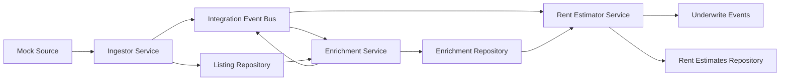

# Integration Tests

This package contains integration tests for the real estate microservices ecosystem.

## Overview

The integration tests verify end-to-end communication between services:

- **Ingestor Service** → **Message Bus** → **Enrichment Service**
- **Enrichment Service** → **Message Bus** → **Rent Estimator Service**
- Complete pipeline: Listing ingestion → Data enrichment → Rent estimation
- Data synchronization and processing workflows
- Event-driven architecture validation

## Test Structure

```
integration-tests/
├── src/
│   ├── ingestor-enrichment.test.ts        # Ingestor → Enrichment integration
│   ├── pipeline-simple.test.ts            # Complete pipeline (working)
│   ├── ingestor-enrichment-rent.test.ts   # Complete pipeline (advanced)
│   └── services.integration.test.ts       # Vitest test wrapper
├── package.json
├── tsconfig.json
├── vitest.config.ts
└── README.md
```

## Running Tests

### Prerequisites

Ensure all services have their dependencies installed:

```bash
cd ../ingestor && npm install
cd ../enrichment && npm install
cd ../rent-estimator && npm install
cd ../integration-tests && npm install
```

### Run Integration Tests

```bash
# Run ingestor → enrichment integration tests
npm run test:integration

# Run complete pipeline integration tests (simplified, working)
npm run test:pipeline

# Run complete pipeline integration tests (advanced, with event bus)
npm run test:pipeline-full

# Run all integration tests
npm run test:all

# Run via Vitest (with test runner features)
npm test

# Watch mode
npm run test:watch
```

### Run from Root Directory

```bash
# From the realestate root directory
npm run test:integration
```

## What Gets Tested

### 1. Message Bus Communication

- ✅ Ingestor publishes `listing_changed` events
- ✅ Enrichment service subscribes to events
- ✅ Events are properly routed and handled
- ✅ Error handling and resilience

### 2. Data Flow

- ✅ Ingestor processes mock listings
- ✅ Events trigger enrichment processing
- ✅ Enriched data is stored correctly
- ✅ Data synchronization between services

### 3. Business Logic

- ✅ Debouncing logic (immediate vs. delayed processing)
- ✅ Enrichment calculations (taxes, scores, priors)
- ✅ Underwrite event publishing
- ✅ Idempotency guarantees

### 4. Update Scenarios

- ✅ Price changes trigger immediate processing
- ✅ Non-financial changes are debounced
- ✅ Multiple updates are handled correctly

## Complete Pipeline Test Coverage

The complete pipeline integration test (`ingestor-enrichment-rent.test.ts`) covers:

### 1. End-to-End Flow

- ✅ Ingestor receives listing → Enrichment processes → Rent Estimator calculates
- ✅ Event chain: `listing_changed` → `data_enriched` → `underwrite_requested`
- ✅ Data flows correctly between all three services
- ✅ Consistent IDs and property details across services

### 2. Rent Estimation Logic

- ✅ Uses enriched geo data (lat/lng, FSA) for comps search
- ✅ Incorporates enriched priors data in calculations
- ✅ Produces valid rent estimates with uncertainty bands
- ✅ Material change detection triggers underwrite events

### 3. Batch Processing

- ✅ Multiple listings processed simultaneously
- ✅ Correct event counts (3 events per listing)
- ✅ No cross-listing data contamination

### 4. Data Consistency

- ✅ Property attributes (beds, baths, type) consistent across services
- ✅ Address data (city, postal code, FSA) properly propagated
- ✅ Enrichment data properly consumed by rent estimator

## Test Data

The integration tests use mock data that simulates:

- **Toronto Condo**: Downtown location with coordinates
- **Toronto Apartment**: Requires geocoding
- **Price Updates**: Triggers enrichment recalculation
- **Multi-bedroom Units**: Different bedroom counts for rent estimation
- **Batch Scenarios**: Multiple listings with varying characteristics

## Architecture



## Integration Event Bus

The integration tests use a custom `IntegrationEventBus` implementation that:

- Simulates real message bus behavior (Redis, SQS, RabbitMQ, etc.)
- Provides synchronous testing capabilities
- Tracks published events for verification
- Supports multiple subscribers per topic
- Handles complete event flow: `listing_changed` → `data_enriched` → `underwrite_requested`

## Configuration

### Test Timeouts

- Default: 30 seconds per test
- Configurable in `vitest.config.ts`

### Service Configuration

- **Debounce**: 1 second (shortened for testing)
- **Log Level**: Info
- **Cache**: In-memory for isolation
- **APIs**: Mock mode for deterministic results

## Troubleshooting

### Common Issues

1. **Timeout Errors**

   - Increase test timeout in vitest config
   - Check for deadlocks in event processing

2. **Missing Events**

   - Verify service startup order
   - Check message bus subscription timing

3. **Data Sync Issues**
   - Ensure proper data format conversion
   - Verify repository implementations

### Debug Mode

Enable verbose logging:

```bash
DEBUG=* npm run test:integration
```

## Adding New Tests

1. Create test in `src/` directory
2. Import required services and utilities
3. Use `SharedMessageBus` for communication
4. Add to Vitest test suite if needed

Example:

```typescript
import { testNewIntegration } from "./new-integration.test";

describe("New Integration", () => {
  it("should test new functionality", async () => {
    const result = await testNewIntegration();
    expect(result.success).toBe(true);
  });
});
```

## Dependencies

- **Services**: References to `../ingestor` and `../enrichment`
- **Testing**: Vitest, TypeScript, ts-node
- **Node.js**: 18+ required

## CI/CD Integration

The integration tests can be run in CI/CD pipelines:

```yaml
# Example GitHub Actions
- name: Run Integration Tests
  run: |
    cd integration-tests
    npm install
    npm test
```

## Performance Considerations

- Tests use in-memory implementations for speed
- Mock external APIs to avoid rate limits
- Parallel test execution is supported
- Clean up resources after each test
